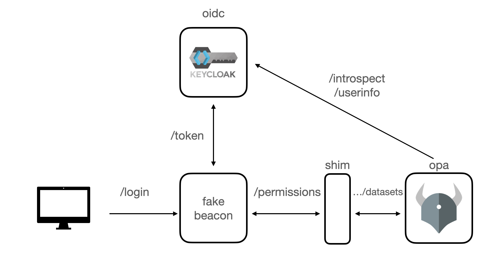

# Beacon Permissions Server



## Running

Generate internal TLS certificates, self-signed by a root CA:

```
./generate-certs.sh
```

You'll be asked for a passphrase for the signing key and to validate it, and then asked for that key three times more.

Once done, fire everything up - currently that's the IdP (Keycloak), permission engine (OPA), and fake_beacon, which
plays role of a beacon here - triggering login and requesting permissions, and a shim between the fake_beacon and
opa:

```
docker-compose up -d
```

When keycloak is up and running (when `docker-compose logs oidc` shows `Admin console listening`), it should be ready to go -
the keycloak database here is preconfigured with two users (user1 and user2), with user1 being a trusted researcher.
In the OPA configuration, user1 has  access to controlled dataset #4, (and registered #3 since they are a trusted researcher)
and user2 is has access to controlled dataset #5.

In addition to the policies defined in OPA (the permissions engine), OPA directly connects to the IdP's userinfo
to validate the token.

When everything is ready, you can "log in" to the fake beacon; it currenly returns the access token to you, which of course
isn't realistic:

```
curl "http://localhost:8000/login?username=user1&password=pass1"

```

you can capture the tokens as:

```
TOKEN1=$( curl "http://localhost:8000/login?username=user1&password=pass1" | jq .access_token | tr -d \" )
TOKEN2=$( curl "http://localhost:8000/login?username=user2&password=pass2" | jq .access_token | tr -d \" )
```

then you can have the beacon query the permissions server:

```
curl "http://localhost:8000/permissions?token=${TOKEN1}" | jq .
curl "http://localhost:8000/permissions?token=${TOKEN2}" | jq .
```

Both users can access the open data sets, only trusted researcher `user1` can access the registered datset,
and each can access their particular controlled dataset.


Note that if the users don't appear to be present in keycloak, you can create them yourself the following
script creates the realm, sets up clients for the login process, and creates the users:

 ```
 ./oidc/config-oidc-service
 ```
That restarts the IdP and so will take 20 seconds or so.
